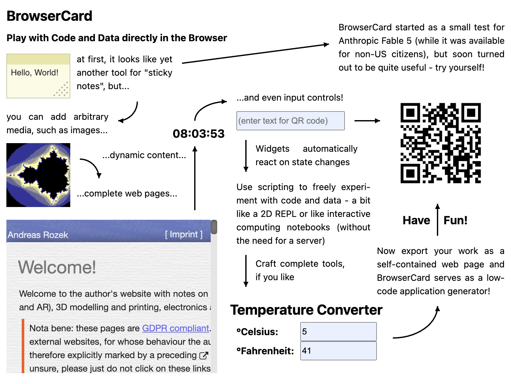

# BrowserCard #

**a HyperCard reinterpretation for the web — build, script and share interactive card decks right in your browser, then embed them anywhere as a custom element**

BrowserCard (abbreviation: **BC**) is a browser-based reinterpretation of [NovoCard](http://plectrum.com/novocard/NovoCard.html) by Plectrum - itself a reinterpretation of Apple's legendary [HyperCard](https://en.wikipedia.org/wiki/HyperCard) (1987). NovoCard was originally an iPad app (2012-2013) but BrowserCard brings the concept to modern desktop and mobile browsers - without any server: decks live in your browser's IndexedDB and may be exported as plain JSON files or complete web pages.

> **new** now with initial support for "vibe coding": find a system (or project) prompt in file [SystemPrompt.md](./ai/SystemPrompt.md) and a complete agent skill in folder [browser-card](./ai/browser-card). An MCP-Server for live coding support within BC itself is planned for the end of next week.

Try it [live in your browser](https://rozek.github.io/browser-card/demos/index.html) or work through the [Tutorial](https://rozek.github.io/browser-card/demos/Tutorial.html)!



> This work was intended as a test (of my agent skills and) of Anthropic's new model "Fable 5": the preparatory work - in the form of an analysis of the available information on NovoCard, considerations regarding useful changes for use in the browser, and the creation of a data model and a specification - was done in advance (by [my own variant](https://github.com/rozek/nanoclaw) of [nanoclaw](https://github.com/nanocoai/nanoclaw)); but the actual implementation was handled almost entirely by Claude Cowork and Fable 5. And, what can I say: in my opinion, the new model passed with flying colors!

## What you can do with it

**Build decks visually.** A deck is a document made of cards, and cards carry widgets: buttons (8 styles, incl. checkboxes and radio buttons), text fields (editable or locked, with or without ruled lines), shapes (rectangles, ovals, lines, arcs and polygons - with arrowheads, if you like), pictures, and fully custom widgets. Switch the designer into edit mode and place widgets by dragging, resize them with eight handles, nudge them pixel-wise with the arrow keys, or let them snap to a configurable grid. Select several widgets at once - Shift/Cmd-click to add or remove individual ones, or rubber-band a rectangle over the canvas - then move, resize, copy, cut or delete them together. A properties panel lets you inspect and edit every detail - including an anchor-based geometry system that keeps widgets in place (or lets them stretch) when a deck is shown at a different size (the panel edits a single widget; with several selected it offers the shared group actions).

**Script everything with plain JavaScript.** Every visual - deck, card or widget - has an asynchronous script, written in ordinary JavaScript with a tiny, HyperCard-inspired API. Register handlers with `on('click', ...)`, navigate with `go(nextCard)` or `go('Card Name')`, open dialogs with `await answer('Really?', 'Yes', 'No')` and `await ask('Your name?')`, print to a built-in console, start self-cleaning timers with `after()` and `every()`, access other widgets via `Widget()` and fire events on them with `Widget(...).triggered(...)`. Custom widgets render themselves with [Preact](https://preactjs.com) + [htm](https://github.com/developit/htm) templates - reactive state included: assign to `my.Count` and the widget re-renders.

**Stay organized.** The decks panel lists every deck stored in your browser - create, open, rename or delete them there, and optionally enable "remember last deck on reload" (off by default) so the designer reopens the deck you last worked on after a page reload, if it still exists. The card browser shows live wireframe thumbnails of all cards in the current deck and lets you add, duplicate, rename, reorder and delete cards. Everything you do in edit mode is auto-saved to IndexedDB and protected by a 100-step undo/redo (Ctrl/Cmd+Z / Shift+Z).

**Move content around.** Copy cards and one or more widgets at once to the system clipboard (with BrowserCard-specific MIME types and a plain text fallback) and paste them into another card, another deck, or another browser tab - BrowserCard detects by itself what the clipboard contains. Import decks from JSON files or directly from a URL; export them as JSON, as a ready-to-paste embedding snippet, or as a complete standalone web app.

**Take screenshots.** The 📷 button in the footer downloads a PNG of the current card - always in the deck's native pixel size, no matter how the card is currently scaled on screen.

**Share your work.** Exported decks run on any web page - without the designer chrome, without IndexedDB, without any build step. One `<script>` tag, one custom element, done.

## Using the designer

Load the module and place a `<bc-designer>` element - that's all:

```html
<!DOCTYPE html>
<html lang="en">
<head>
  <meta charset="UTF-8"/>
  <meta name="viewport" content="width=device-width, initial-scale=1.0"/>
  <title>BrowserCard Designer</title>
  <style>
    html, body { margin:0; width:100%; height:100%; overflow:hidden }
  </style>
</head>
<body>
  <script type="module" src="https://rozek.github.io/browser-card/dist/BrowserCard.js"></script>
  <bc-designer style="display:block; width:100%; height:100%"></bc-designer>
</body>
</html>
```

`<bc-designer>` supports the following attributes:

| Attribute  | Type        | Description |
| ---------- | ----------- | ----------- |
| `src`      | JSON string | initial deck data; empty = built-in demo deck; a persisted copy from IndexedDB takes precedence |
| `name`     | string      | determines the IndexedDB key (`bc-deck:<name>`) under which the deck is persisted |
| `readonly` | boolean     | locks the deck (presence = locked); a deck whose `readOnly` property is `true` is locked as well |

While editing, the deck is auto-saved to IndexedDB (debounced, and again when you leave edit mode). The "Deck" menu offers manual save, revert, reset, JSON export/import, import from URL, and the two embedding exports described below.

## Embedding decks in web pages

`<bc-deck>` renders just the deck itself - no menu bar, no footer, no IndexedDB, no global keyboard handlers. Dialogs stay confined to the element, so several decks may live on the same page:

```html
<script type="module" src="https://rozek.github.io/browser-card/dist/BrowserCard.js"></script>

<bc-deck
  style="display:block; width:600px; height:450px"
  src="... HTML-escaped JSON serialization of the deck ..."
></bc-deck>
```

You rarely have to write this by hand: in the designer, open the "Deck" menu and choose

- **Export for Embedding…** - downloads an HTML snippet containing the `<script>` tag and a ready-made `<bc-deck>` element (in the deck's native size) which you can copy into any page, or
- **Export as Standalone App…** - downloads a complete HTML page in which the deck fills the browser window.

### Sizing

A deck has a *native* canvas size, set in the designer via the deck properties `CardWidth`/`CardHeight` (default: 800x600). When a deck is displayed, the canvas is scaled proportionally to fit its element - so the element's CSS size (`style="width:...; height:..."`) determines what you see. If you want to *override* the native canvas size in a particular page, set the CSS variables `--canvas-width`/`--canvas-height` on the element:

```html
<bc-deck style="display:block; width:100%; height:100%;
                 --canvas-width:800; --canvas-height:600"
  src="..."></bc-deck>
```

Priority: CSS variables → `CardWidth`/`CardHeight` from the deck → built-in defaults.

By default the scale factor is *computed* so the canvas fits its element. To pin it instead, set the CSS variable `--canvas-scale` (a unitless, positive number) on the element - it overrides the fit calculation (`1.0` = native size, `2.0` = double size, …):

```html
<bc-deck style="display:block; width:100%; height:100%;
                 --canvas-width:800; --canvas-height:600; --canvas-scale:1.0"
  src="..."></bc-deck>
```

A non-numeric or non-positive `--canvas-scale` is ignored, falling back to the automatic fit-to-element scaling. The pinned value applies to normal (browse) mode only; while editing, the canvas may be scaled *down* to fit the available area, but never *up* beyond `--canvas-scale`.


## Scripting Guide

Every visual - the deck itself, every card, and every widget on a card - has its own script, written in plain, modern JavaScript with a small set of injected functions and values. Edit scripts in the properties panel (applied when the field loses focus) or click "⤢" to open them in a draggable, resizable editor window.

A script runs **asynchronously** whenever its visual is instantiated (when the deck loads, when its card is shown) - and again after every script change. Its job is to do any setup it needs and to register handlers for messages:

> Nota bene: because of their asynchronous nature, you are allowed to import external ESM modules using "import" expressions like `import { z } from 'https://cdn.jsdelivr.net/npm/zod@3/+esm'`

```javascript
on('click', () => go(nextCard))            // a button script: navigate on click
```

Handlers may be `async` and may use the full BrowserCard Scripting API:

```javascript
on('click', async () => {
  const Choice = await answer('Delete everything?', 'Yes', 'No')
  if (Choice === 'Yes') {
    const Reason = await ask('Why?', 'just because')
    if (Reason != null) { println('deleted because: ' + Reason) }
  }
})
```

### Reactive state with `me` / `my` / `I`

Inside a script, `me` is a reactive proxy of the visual itself (`my` and `I` are exact synonyms - use whichever reads best). Reading gives you its current properties (including live geometry), writing re-renders it immediately - and since assignments become part of the deck data, they are persisted together with the deck when you edit in the designer:

```javascript
on('render', () => {                              // a custom widget: a counter
  const Count = my.Count ?? 0
  return html`
    <div style=${{ textAlign:'center' }}>
      <b>${Count}</b>
      <button onClick=${() => { my.Count = Count+1 }}>+</button>
    </div>
  `
})
```

Use `my.own` for *transient* script-private state: writes to `my.own.whatever` neither re-render nor persist.

Custom widgets ("generic" widgets) render themselves: register `on('render', ...)` and return an [htm](https://github.com/developit/htm) template (`html\`...\``) - Preact takes care of efficient updates. Like every visual, a custom widget can fire events with `trigger(msg, ...)` / `await triggered(msg, ...)` (bubbling up to itself, its card, then the deck) and receives `Configuration` - a read-only JSON object you edit as "Configuration (JSON)" in the properties panel. `Configuration` lets the same widget script be reused with different settings:

```javascript
on('render', () => html`<div>Hello, ${Configuration.Name ?? 'world'}!</div>`)
```

With `Configuration = { "Name":"World" }` this widget greets "Hello, World!". Use `Configuration` for static, design-time settings; use `me.*` for mutable runtime state.

Custom widgets also have a standard **`Value`** property - the same one a field has. It is edited in the properties panel ("Custom Widget" section) just like a field's text, and read or written from the script via `my.Value`. Unlike a field, a custom widget does *not* render its `Value` on its own: it is plain data until the widget's `on('render', ...)` (or a behavior) displays it. This makes `Value` the natural place for the widget's primary text content - a `TitleView` behavior, for instance, simply renders `my.Value` in bold:

```javascript
// TitleView widget behavior:
on('render', () => html`
  <div style=${{ fontSize:'22px', fontWeight:'bold' }}>${my.Value ?? ''}</div>
`)
```

`Value` is persisted with the deck and can be changed at runtime (`my.Value = '…'` re-renders immediately), so the same widget can serve as a design-time label and a script-driven display.

### Using Preact — do not re-import it

BrowserCard runs on a single, bundled Preact instance. If a script imports Preact again (e.g. `import { useState } from 'https://…/preact'`), it gets a *second*, unconnected copy whose hooks and rendering do not work together with BrowserCard's - widgets then misbehave in subtle ways.

Therefore: **never import preact in a script**. Everything you need is already provided. The `html` tag covers most cases; for the rest, **use the injected `preact` object**:

```javascript
on('render', () => {
  const [open, setOpen] = preact.useState(false)        // NOT: import … from 'preact'
  return html`
    <button onClick=${() => setOpen(! open)}>${open ? 'hide' : 'show'}</button>
    ${open && html`<div>now you see me</div>`}
  `
})
```

The `preact` object bundles the most important exports: `h`, `Fragment`, `render`, `createElement`, `cloneElement`, `createRef`, `createContext`, `toChildArray`, `createPortal`, `memo`, `forwardRef`, and the hooks `useId`, `useRef`, `useState`, `useReducer`, `useEffect`, `useLayoutEffect`, `useCallback`, `useMemo`, `useContext`, `useErrorBoundary`. (The same object is also reachable as `BC.preact` for external behaviors.)

### Timers that clean up after themselves

`after(ms, fn)` and `every(ms, fn)` register timers on the script instance - they are cancelled automatically when the visual disappears (card change, script change, deletion). No `clearInterval` bookkeeping needed:

```javascript
on('ready', () => every(1000, () => { my.Time = Date.now() }))
on('render', () => html`<div>${new Date(my.Time ?? Date.now()).toLocaleTimeString()}</div>`)
```

### Talking to other widgets

`Widget(nameOrIndex)` returns the reactive proxy of another widget on the current card. Every proxy (and `me`, `my.Card`, `my.Deck`) carries `trigger(event, ...args)` / `await triggered(event, ...args)`, so you fire an event straight on the target:

```javascript
// in the script of widget "Sender":
on('click', () => Widget('Display').triggered('showValue', 42))

// in the script of widget "Display":
on('showValue', (Value) => { my.shownValue = Value })
```

The event still bubbles up from the target (widget → card → deck) to the first matching handler, and `triggered` resolves with that handler's return value.

### Imports and behaviors

Scripts may import any ES module: `const { default:fn } = await import('https://...')`. With `await behaveLike('name')` a script loads and runs a predefined *behavior* (the intrinsic behaviors `button`, `field`, `shape` and `picture` are built in; external ones are resolved as URL, absolute or relative path, or by name from GitHub) - see [Behaviors](#behaviors) below for how to write and share your own.

## Script API Reference

### Lifecycle and messages

| Message | When | Notes |
|---------|------|-------|
| `render` | on every (re-)render of the visual | must return `html\`...\`` **synchronously**; the result is rendered first inside the visual's DOM element |
| `update` | synchronously **before** every `render` | use to pull external state into the widget before rendering (see [Widget behavior pattern](#widget-behavior-pattern)) |
| `ready` | once all inner visuals have been instantiated and initialized | fires inside-out: widgets → card → deck. a card is re-mounted on every navigation, so this fires on each visit |
| `obsolete` | right before the visual is removed (navigation, deletion, script change) | for cleanup; `after()`/`every()` timers are cancelled automatically afterwards |
| `click` | a button (or auto-hiliting picture) was clicked | bubbles up the hierarchy: the widget's script, then its card's, then the deck's |
| *custom* | whatever you `trigger()`/`triggered()` (on the current visual or another proxy) | handler arguments = the extra `trigger()`/`triggered()` arguments |

### Functions

| Function | Description |
|----------|-------------|
| `on(Msg, Fn)` | registers a handler for a message (one handler per message; later calls replace earlier ones) |
| `go(Target)` | navigates to a card: a card ref (`nextCard`, `Card(...)`, ...), a card name, or a 0-based index |
| `Card(NameOrIndex)` | returns a card ref by name or 0-based index (or `null`) |
| `CardCount()` | number of cards in the deck |
| `Widget(NameOrIndex)` | reactive proxy of a widget on the current card, by name or 0-based index (or `null`) |
| `my.Card.Index` | 0-based position of a card in its deck (read/write; assigning moves the card, keeping it shown) — `my.Card.Index` gives the current card's index |
| `trigger(Event, ...Args)` | fires an event on the current visual; it bubbles up (widget → card → deck) to the **first** matching handler. Extra arguments are passed to the handler |
| `await triggered(Event, ...Args)` | like `trigger`, but resolves with the handler's return value (`undefined` if none matched); a handler's exception propagates to the caller |
| `Widget(...).trigger(Event, ...)` / `.triggered(...)` | the same two methods exist on every proxy (`me`, `Widget(...)`, `my.Card`, `my.Deck`), so you can fire an event on **another** visual and let it bubble up from there |
| `await answer(Message, ...Buttons)` | shows a dialog; resolves with the label of the clicked button |
| `await ask(Prompt, Default?)` | shows an input dialog; resolves with the input or `null` on cancel |
| `openURL(URL)` | opens a URL in a new tab |
| `print(...)` / `println(...)` | writes to the built-in console (which pops up automatically) |
| `clearConsole()` | clears the built-in console |
| `after(ms, Fn)` | one-shot timer, cancelled automatically on teardown |
| `every(ms, Fn)` | repeating timer, cancelled automatically on teardown |
| `await behaveLike(Name)` | loads and runs a behavior (one per visual) |
| `defineLocalBehavior(Name, Fn)` | stores `Fn`'s source text as a local behavior in the deck (`Deck.localBehaviors.<Name>`) |
| `localBehavior(Name)` | returns a data-URI module for the stored local behavior `Name`, ready for `behaveLike(...)` |

### Values

| Value | Description |
|-------|-------------|
| `me` / `my` / `I` | reactive proxy of the visual running the script (three synonyms) |
| `my.Deck` | proxy of the surrounding deck |
| `my.Card` | proxy of the current card |
| `my.Card.WidgetList` | proxies of all widgets on the current card, in drawing order |
| `my.own` | plain object for transient, script-private state (no re-render, no persistence) |
| `my.View` | the visual's own DOM element once mounted - the widget's wrapper for widgets, `.bc-card-canvas` for cards, `.bc-app` for the deck (read-only; `undefined` before the first render and after removal - always guard with `if (my.View != null)`) |
| `nextCard`, `prevCard`, `firstCard`, `lastCard` | card refs for `go()` |
| `html` | the htm/Preact template tag for `render` handlers (do **not** re-import Preact) |
| `preact` | the most important Preact exports, bundled into one object (see below) - use these instead of importing Preact |
| `Configuration` | *(custom widgets only)* the widget's read-only JSON configuration object (edited as "Configuration (JSON)" in the designer) |

### Geometry on `me` (widgets only)

| Property | Description |
|----------|-------------|
| `my.x`, `my.y`, `my.Width`, `my.Height` | live pixel geometry, computed from the anchor system |
| `my.Anchors`, `my.Offsets` | the underlying anchor-based geometry (writable) |
| `I.changeGeometryTo(x?, y?, w?, h?)` | computes and applies new offsets from pixel values; omitted arguments keep their current value |

```javascript
I.changeGeometryTo(my.x + 20)               // move 20px to the right
I.changeGeometryTo(null, null, 300)         // set width to 300px, keep position
```

## Behaviors

A *behavior* is a reusable script, packaged as an ordinary ES module - the BrowserCard way of sharing functionality between widgets, cards and decks. A visual whose script calls `await behaveLike(...)` runs the behavior as if its code were part of the script itself (only one behavior per visual; additional calls are ignored).

### Widget behavior pattern

Well-designed custom widget behaviors follow a simple convention that decouples the widget's internal rendering from the card or deck state it represents:

- **`on('update', ...)`** — called synchronously before every render. Use it to pull the "outer" value (from `my.Card` or `my.Deck`) into the widget's own local state. This ensures the widget always displays the current external value, even if it was changed from elsewhere.

- **`trigger('change', value)`** (or `await triggered('change', value)`) — fired whenever the user makes an input. The event bubbles up until a handler is found, so the card (or deck) script can listen for it and store the new value in its own state.

This separation means the widget behavior doesn't need to know who owns the value - it just reads from a well-known property and announces changes. The consumer decides where to persist them.

Example — a `NumberInput` behavior and its use in a Temperature Converter card:

```javascript
// NumberInput behavior (the widget):
on('update', () => {
  my.Value = my.Card.Temperature   // pull card state into widget before render
})

on('change', (Value) => {
  my.Card.Temperature = Value      // push user input back to card
})

on('render', () => {
  const Value = my.Value ?? 0
  return html`
    <input
      type="number"
      value=${Value}
      style=${{ width:'100%', height:'100%', boxSizing:'border-box', padding:'4px 6px', fontSize:'inherit' }}
      onInput=${(e) => {
        const n = e.target.valueAsNumber
        if (!isNaN(n)) { my.Value = n; trigger('change', n) }
      }}
    />
  `
})
```

The card script simply bridges its own state to the behavior's convention - it doesn't need to know anything about how the widget renders itself:

```javascript
// Card script (or another widget's script):
on('ready', () => {
  my.Card.Temperature = 20        // set initial value
})
```

If several widgets on the same card share state in this way, changing one automatically updates all others on the next render cycle, because each widget's `update` handler re-reads `my.Card.Temperature`.

### Writing a behavior

Create a `.js` file whose **default export** is an async function. It receives the complete script context as a **single object with named entries** - simply destructure what you need. Everything from the [Script API Reference](#script-api-reference) is available, including `on`, the visual proxy as `me` / `my` / `I` (three synonyms - pick one), `html`, `after`, `every`, `Configuration` and `dispatch`:

```javascript
// Blinker.js - a behavior for "generic" widgets: makes its content blink

export default async function ({ on, my, every, html }) {
  on('ready',  () => every(500, () => { my.shown = ! my.shown }))
  on('render', () => html`
    <div style=${{
      display:'flex', alignItems:'center', justifyContent:'center',
      width:'100%', height:'100%',
      visibility:(my.shown === false ? 'hidden' : 'visible'),
    }}>${my.Value ?? 'blink!'}</div>
  `)
}
```

The visual's own script may then add widget-specific details before or after loading the behavior:

```javascript
await behaveLike('./Blinker.js')
on('click', () => go(nextCard))      // an additional, widget-specific handler
```

Note: `on()` registers one handler per message - if both the behavior and the script register the same message, the later registration (usually the script's) wins.

### Importing ("using") a behavior

`behaveLike()` accepts four notations:

| Argument | Resolution |
|----------|-----------|
| `'https://...'` | used as is |
| `'/path/to/Behavior.js'` | relative to the current origin |
| `'./Behavior.js'`, `'../shared/Behavior.js'` | relative to the current page |
| `'name'` (no slashes, no dots) | `https://rozek.github.io/browser-card/behaviors/<decks\|cards\|widgets>/<name>.js` - depending on the type of the calling visual |

The intrinsic names `button`, `field`, `shape` and `picture` are reserved for the built-in behaviors (they are also what renders these widget types - a button script implicitly starts with `await behaveLike('button')`).

### Local behaviors

A behavior need not be a separate file: a deck can carry its own behaviors inline. `defineLocalBehavior(Name, Fn)` stores the **source text** of `Fn` in the deck (as `Deck.localBehaviors.<Name>`, so it is persisted and human-readable); `localBehavior(Name)` turns that stored source into a `data:`-URI ES module that `behaveLike()` can load:

```javascript
// once (e.g. in the deck script), define a reusable local behavior:
defineLocalBehavior('Blink', async ({ on, my, every, html }) => {
  on('ready',  () => every(500, () => { my.shown = ! my.shown }))
  on('render', () => html`<div style=${{ visibility:(my.shown === false ? 'hidden' : 'visible') }}>${my.Value ?? 'blink!'}</div>`)
})

// in any widget (or card) script:
await behaveLike(localBehavior('Blink'))
```

The function receives the full [script context](#script-api-reference) as its single argument - exactly like a file behavior - so it must be **self-contained**: it may only use its destructured parameters and real globals (`globalThis.BC`, `document`, …), never variables from the script that defined it (only the source text is stored, not its closure). As with any behavior, only one `behaveLike(...)` runs per visual. `Deck.localBehaviors` is ordinary deck data, so local behaviors travel with the deck's JSON export.

### Exporting ("sharing") a behavior

Since behaviors are plain ES modules, sharing one simply means hosting the file somewhere it can be imported from:

- **GitHub Pages** (like this repo's `behaviors/` folder): served with the correct MIME type and CORS headers - bare-name resolution expects exactly this layout
- **any web server** under your control - make sure `.js` files are served as `text/javascript` and, for cross-origin use, with `Access-Control-Allow-Origin: *`
- **jsDelivr** for files in any public GitHub repo: `https://cdn.jsdelivr.net/gh/<user>/<repo>/<path>.js` (note: `raw.githubusercontent.com` does *not* work - it serves `text/plain`, which browsers refuse to import)

To contribute a behavior to the shared collection, place it in this repository's `behaviors/decks`, `behaviors/cards` or `behaviors/widgets` folder (via pull request) - it then becomes loadable by its bare name.

### Predefined widget behaviors

This repository provides a small family of ready-to-use widget behaviors, most of which display a custom widget's `Value` property (see [custom widgets](#reactive-state-with-me--my--i) above). Load any of them with `await behaveLike('<name>')`:

| Behavior | Purpose |
|----------|---------|
| `TitleView` | shows `my.Value` as 22px bold text |
| `SubtitleView` | shows `my.Value` as 18px bold text |
| `Label` | shows `my.Value` as 15px bold text |
| `TextView` | shows `my.Value` as 15px normal text |
| `FineprintView` | shows `my.Value` as 13px normal text |
| `HTMLView` | renders `my.Value` as raw HTML |
| `MarkdownView` | renders `my.Value` as Markdown - with syntax highlighting, math and Mermaid diagrams |
| `ImageView` | shows the image loaded from the URL in `my.Value` |
| `SVGView` | renders the inline SVG source held in `my.Value` |
| `WebView` | shows the web page at the URL in `my.Value` inside an `<iframe>` |
| `nativeButton` | a native `<button>` whose (HTML) label is `my.Value` |
| `nativeCheckbox` | a native checkbox whose state is `my.Value` (`on`/`true`, `off`/`false`, `-` = indeterminate) |
| `nativeRadiobutton` | a native radio button whose state is `my.Value` (`on`/`true`, `off`/`false`) |
| `nativeGauge` | a native `<meter>` gauge driven by the `Value`/`Minimum`/`lowerBound`/`Optimum`/`upperBound`/`Maximum` parameters |
| `nativeProgressbar` | a native `<progress>` bar driven by the `Value`/`Maximum` parameters |
| `nativeSlider` | a native range `<input>` driven by `Value`/`Minimum`/`Stepping`/`Maximum`/`Hashmarks` |
| `nativeTextlineInput` | a single-line text `<input>` with `Value`/`invalid`/`Placeholder`/`readonly`/`minLength`/`maxLength`/`Pattern`/`SpellChecking`/`Suggestions`/`disabled` |
| `nativePasswordInput` | a password `<input>` with `Value`/`invalid`/`Placeholder`/`readonly`/`minLength`/`maxLength`/`Pattern`/`disabled` |
| `nativeNumberInput` | a number `<input>` with `Value`/`invalid`/`Placeholder`/`readonly`/`Minimum`/`Stepping`/`Maximum`/`Suggestions`/`disabled` |
| `nativeEMailAddressInput` | an email `<input>` with `Value`/`multiple`/`invalid`/`Placeholder`/`readonly`/`minLength`/`maxLength`/`Pattern`/`Suggestions`/`disabled` |
| `nativePhoneNumberInput` | a telephone `<input>` with `Value`/`invalid`/`Placeholder`/`readonly`/`minLength`/`maxLength`/`Pattern`/`Suggestions`/`disabled` |
| `nativeURLInput` | a URL `<input>` with `Value`/`invalid`/`Placeholder`/`readonly`/`minLength`/`maxLength`/`Pattern`/`Suggestions`/`disabled` |
| `nativeSearchInput` | a search `<input>` with `Value`/`invalid`/`Placeholder`/`readonly`/`minLength`/`maxLength`/`Pattern`/`SpellChecking`/`Suggestions`/`disabled` |
| `nativeTimeInput` | a time `<input>` with `Value`/`invalid`/`readonly`/`withSeconds`/`Minimum`/`Maximum`/`Suggestions`/`disabled` |
| `nativeDateTimeInput` | a datetime-local `<input>` with `Value`/`invalid`/`readonly`/`withSeconds`/`Minimum`/`Maximum`/`Suggestions`/`disabled` |
| `nativeDateInput` | a date `<input>` with `Value`/`invalid`/`readonly`/`Minimum`/`Maximum`/`Suggestions`/`disabled` |
| `nativeWeekInput` | a week `<input>` with `Value`/`invalid`/`readonly`/`Minimum`/`Maximum`/`Suggestions`/`disabled` |
| `nativeMonthInput` | a month `<input>` with `Value`/`invalid`/`readonly`/`Minimum`/`Maximum`/`Suggestions`/`disabled` |
| `nativeDropDown` | a `<select>` whose `Options` are selectable values or `value:label` pairs (`Value`/`Options`/`disabled`) |
| `nativeColorInput` | a colour `<input>` with `Value`/`readonly`/`Suggestions`/`disabled` |
| `nativeTextInput` | a multi-line `<textarea>` with `Value`/`invalid`/`Placeholder`/`readonly`/`minLength`/`maxLength`/`LineWrapping`/`Resizability`/`SpellChecking`/`disabled` |
| `FAIcon` | a clickable FontAwesome 4.7.0 icon (`Icon` = icon name, `Color`, `hilite`, `disabled`) |
| `Icon` | a clickable bitmap icon (24x24 contain; greyscale, or tinted in `Color`; `hilite` adds an `active` highlight box) |
| `PseudoFileInput` | an `Icon` that opens a file chooser on click (`Icon`/`Color`/`multiple`/`FileTypes`/`disabled`) |
| `PseudoDropDown` | an `Icon` that opens a drop-down menu on click (`Value`/`Icon`/`Color`/`Options`/`disabled`) |
| `horizontalSeparator` | a thin light-grey line across the widget's vertical middle |
| `verticalSeparator` | a thin light-grey line down the widget's horizontal middle |

`ImageView` and `SVGView` both read a `scaling` (`'none'`, `'stretch'`, `'cover'`, `'contain'`) and an `alignment` (`'left top'` … `'right bottom'`) from the widget's `Configuration`. `WebView` reads `allowsFullScreen` (boolean), `Permissions` (the iframe's `allow` attribute), `SandboxPermissions` (the `sandbox` attribute - `false` omits it entirely, `''` is maximally restrictive) and `ReferrerPolicy` from `Configuration`. `nativeButton` dispatches a `'click'` message on every click (handle it with `on('click', () => ...)` in the widget's own script) and is locked via `my.disabled = true` (or the `Configuration` field `disabled`). `nativeCheckbox` reflects `my.Value` (`on`/`true`, `off`/`false`, `-` = indeterminate), writes `'on'`/`'off'` back to `my.Value` on every toggle and dispatches `'change'` with the new boolean state; it is locked the same way. `nativeRadiobutton` behaves like `nativeCheckbox` but as a radio button (no indeterminate state). `nativeGauge` reads its numeric parameters `Value`, `Minimum`, `lowerBound`, `Optimum`, `upperBound` and `Maximum` from `my.*` (falling back to `Configuration`), mapping them to the `<meter>` attributes; `Value` may alternatively be given as text in `my.Value`. `nativeProgressbar` works the same way with `Value` and `Maximum` (and shows the indeterminate animation when no `Value` is resolvable). `nativeSlider` reads `Value`, `Minimum`, `Stepping` (may be `'any'`), `Maximum` and `Hashmarks` the same way, dragging writes the value back to `my.Value` and dispatches `'change'`; `Hashmarks` is an array - or a space/comma-separated string - of numbers or `value=label` pairs and is rendered as `<datalist>` tick marks. It is lockable via `my.disabled`/`Configuration.disabled`. `nativeTextlineInput` reads `Value`, `Placeholder`, `readonly`, `minLength`, `maxLength`, `Pattern` (a regular expression the value must match to be valid), `SpellChecking`, `Suggestions` (an array or comma-separated string rendered as a `<datalist>`), `invalid` (forces the invalid state, independent of `Pattern`) and `disabled`; typing writes the value back to `my.Value` and dispatches `'change'`.

`nativePasswordInput` is identical to `nativeTextlineInput` but masks its input (no `SpellChecking`/`Suggestions`). `nativeNumberInput` is the numeric variant, taking `Minimum`/`Stepping` (may be `'any'`)/`Maximum` instead of `minLength`/`maxLength`/`Pattern`. `nativeEMailAddressInput` is the email variant; its `multiple` flag permits several comma-separated addresses. `nativePhoneNumberInput` is the telephone (`type="tel"`) variant with the same parameters as `nativeTextlineInput` (minus `SpellChecking`); `nativeURLInput` is the URL (`type="url"`) variant with the same parameters (and native URL validation); `nativeSearchInput` is the search (`type="search"`) variant (like `nativeTextlineInput`, including `SpellChecking`). `nativeTimeInput` is a `type="time"` field whose `withSeconds` flag adds a seconds field and whose `Minimum`/`Maximum` bound the range; `nativeDateTimeInput` is the `type="datetime-local"` equivalent, while `nativeDateInput`, `nativeWeekInput` and `nativeMonthInput` cover `type="date"`/`"week"`/`"month"` (all without `withSeconds`). All of them also honour an `invalid` flag (on top of the native `Minimum`/`Maximum` check). `nativeDropDown` renders a `<select>` from `Options` - a list (or space-separated string) of values or `value:label` pairs where a leading `-` disables an entry - and writes the chosen value back to `my.Value`. `nativeColorInput` is a `type="color"` picker (`#rrggbb`) whose `Suggestions` appear as swatches. `nativeTextInput` is a multi-line `<textarea>` (filling the widget) whose `LineWrapping` toggles soft wrapping and whose `Resizability` (`'none'`/`'horizontal'`/`'vertical'`/`'both'`) controls the resize handle. `FAIcon` shows a clickable [FontAwesome 4.7.0](https://fontawesome.com/v4/) icon (`Icon` is the icon name such as `fa-home`, `Color` its colour, `hilite` adds the `active` class, `disabled` blocks clicks); it dispatches `'click'`. The FontAwesome stylesheet and webfont are vendored **same-origin** in a `fontawesome/` folder beside `BrowserCard.js` (kept in the repo's `public/`) - no third-party request. `Icon` shows a clickable bitmap (URL from `my.Icon`/`Configuration.Icon`): it is scaled to 24x24 (aspect-preserving `contain`), centred in the widget, and shown greyscale - or, if `Color` is set, tinted in that colour (via a CSS mask, intended for monochrome icons with transparency). It gets the CSS class `active` (a highlight box) when `hilite` is set; it dispatches `'click'` unless `disabled`. A bare name (no `/` and no `.`) is resolved to `icons/<name>.png` beside `BrowserCard.js`; with no source it falls back to a built-in `fa-question-circle-o`-style default.

`PseudoFileInput` and `PseudoDropDown` reuse that icon as a trigger: `PseudoFileInput` overlays a hidden `<input type="file">`, so clicking the icon opens a file chooser (`multiple` allows several files, `FileTypes` sets the `accept` filter as a string or array; `Color` optionally tints the icon) and dispatches the chosen files as `'change'` (an array of `File`). `PseudoDropDown` overlays a transparent native `<select>`, so clicking the icon opens a menu built from `Options` (values or `value:label` pairs, a leading `-` disabling an entry); the picked value is written back to `my.Value` and dispatched as `'change'`, and `Color` optionally tints the icon. All input behaviors keep the value the user is editing untouched **while the input is focused** - external changes to `Value`/`my.Value` are ignored until focus leaves, at which point the display syncs to the current value. `HTMLView`, `SVGView`, `MarkdownView` and `nativeButton` insert markup that originates from `my.Value`; treat that text as you would any HTML/SVG you embed (it is author content, but do not feed untrusted input into it unsanitised).

### MarkdownView and the bundled Markdown toolkit

`MarkdownView` reuses the Markdown stack that is already bundled into BrowserCard rather than pulling in its own copy. For external behaviors these pieces are exposed on the global `BC` object: `BC.Marked` (the [marked](https://marked.js.org) class), `BC.markedHighlight` and `BC.markedKatex` (the highlight/KaTeX extensions), `BC.hljs` (a [highlight.js](https://highlightjs.org) core with `css`, `javascript`, `java`, `json`, `typescript`, `html`/`xml` registered) and `BC.ModuleURL` (the running module's URL, used to locate the assets beside it). It renders ` ```mermaid ` fenced blocks as [Mermaid](https://mermaid.js.org) diagrams, code blocks with highlight.js, and `$…$` / `$$…$$` math with KaTeX (inline `$…$` works even when touching brackets, via the `nonStandard` option; override per widget with the `Configuration` field `KaTeX`).

The vendored assets are **served same-origin** beside the running `BrowserCard.js`: the KaTeX CSS + web-fonts and the Mermaid build live in a `markdown/` folder, the content/highlight stylesheet in a hand-authored `markdown.css` next to that folder (kept in the repo's `public/` folder, which Vite copies into `dist/` on build). `MarkdownView` never issues a third-party network request - everything is loaded from the same origin that serves BrowserCard, with the location derived from `BC.ModuleURL`. Override it with the optional `Configuration` field `AssetBase` (and set `{ "Mermaid": false }` to disable diagram rendering):

```javascript
await behaveLike('MarkdownView')   // then type Markdown into the widget's "Value"
```

## Technology

- TypeScript + [Preact](https://preactjs.com) + [htm](https://github.com/developit/htm) - no JSX, no build step required for scripts
- a single, self-contained ESM module defining the custom elements `<bc-designer>` and `<bc-deck>`
- deck data as plain JSON, persisted in IndexedDB via [idb-keyval](https://github.com/jakearchibald/idb-keyval)
- built with [Vite](https://vitejs.dev)

## Build

```bash
npm install
npm run build       # type-checks and bundles dist/BrowserCard.js
npm run dev         # Vite dev server with the demo deck
```

## License

[MIT License](./LICENSE.md)
