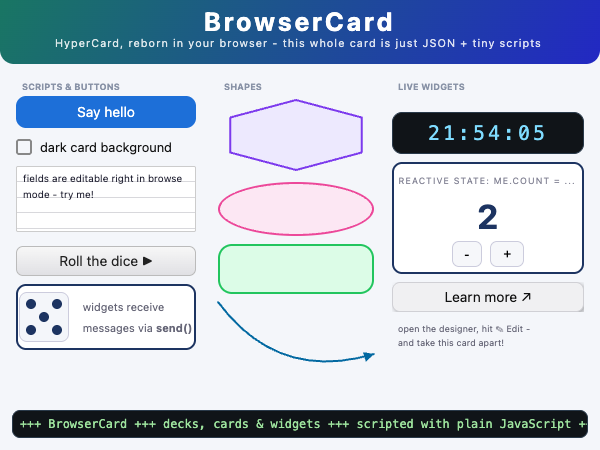

# BrowserCard #

**a HyperCard reinterpretation for the web — build, script and share interactive card decks right in your browser, then embed them anywhere as a custom element**

BrowserCard (abbreviation: **BC**) is a browser-based reinterpretation of [NovoCard](http://plectrum.com/novocard/NovoCard.html) by Plectrum - itself a reinterpretation of Apple's legendary [HyperCard](https://en.wikipedia.org/wiki/HyperCard) (1987). NovoCard was originally an iPad app (2012-2013) but BrowserCard brings the concept to modern desktop and mobile browsers - without any server: decks live in your browser's IndexedDB and may be exported as plain JSON files or complete web pages.

Try it [live in your browser](https://rozek.github.io/browser-card/demos/index.html)!



> This work was intended as a test (of my agent skills and) of Anthropic's new model "Fable 5": the preparatory work - in the form of an analysis of the available information on NovoCard, considerations regarding useful changes for use in the browser, and the creation of a data model and a specification - was done in advance (by [my own variant](https://github.com/rozek/nanoclaw) of [nanoclaw](https://github.com/nanocoai/nanoclaw)); but the actual implementation was handled almost entirely by Claude Cowork and Fable 5. And, what can I say: in my opinion, the new model passed with flying colors!

## What you can do with it

**Build decks visually.** A deck is a document made of cards, and cards carry widgets: buttons (8 styles, incl. checkboxes and radio buttons), text fields (editable or locked, with or without ruled lines), shapes (rectangles, ovals, lines, arcs and polygons - with arrowheads, if you like), pictures, and fully custom widgets. Switch the designer into edit mode and place widgets by dragging, resize them with eight handles, nudge them pixel-wise with the arrow keys, or let them snap to a configurable grid. A properties panel lets you inspect and edit every detail - including an anchor-based geometry system that keeps widgets in place (or lets them stretch) when a deck is shown at a different size.

**Script everything with plain JavaScript.** Every visual - deck, card or widget - has an asynchronous script, written in ordinary JavaScript with a tiny, HyperCard-inspired API. Register handlers with `on('click', ...)`, navigate with `go(nextCard)` or `go('Card Name')`, open dialogs with `await answer('Really?', 'Yes', 'No')` and `await ask('Your name?')`, print to a built-in console, start self-cleaning timers with `after()` and `every()`, access other widgets via `Widget()` and message them with `send()`. Custom widgets render themselves with [Preact](https://preactjs.com) + [htm](https://github.com/developit/htm) templates - reactive state included: assign to `my.count` and the widget re-renders.

**Stay organized.** The decks panel lists every deck stored in your browser - create, open, rename or delete them there. The card browser shows live wireframe thumbnails of all cards in the current deck and lets you add, duplicate, rename, reorder and delete cards. Everything you do in edit mode is auto-saved to IndexedDB and protected by a 100-step undo/redo (Ctrl/Cmd+Z / Shift+Z).

**Move content around.** Copy cards and widgets to the system clipboard (with BrowserCard-specific MIME types and a plain text fallback) and paste them into another card, another deck, or another browser tab - BrowserCard detects by itself what the clipboard contains. Import decks from JSON files or directly from a URL; export them as JSON, as a ready-to-paste embedding snippet, or as a complete standalone web app.

**Take screenshots.** The 📷 button in the footer downloads a PNG of the current card - always in the deck's native pixel size, no matter how the card is currently scaled on screen.

**Share your work.** Exported decks run on any web page - without the designer chrome, without IndexedDB, without any build step. One `<script>` tag, one custom element, done.

## Using the designer

Load the module and place a `<bc-designer>` element - that's all:

```html
<!DOCTYPE html>
<html lang="en">
<head>
  <meta charset="UTF-8"/>
  <meta name="viewport" content="width=device-width, initial-scale=1.0"/>
  <title>BrowserCard Designer</title>
  <style>
    html, body { margin:0; width:100%; height:100%; overflow:hidden }
  </style>
</head>
<body>
  <script type="module" src="https://rozek.github.io/browser-card/dist/BrowserCard.js"></script>
  <bc-designer style="display:block; width:100%; height:100%"></bc-designer>
</body>
</html>
```

`<bc-designer>` supports the following attributes:

| Attribute  | Type        | Description |
| ---------- | ----------- | ----------- |
| `src`      | JSON string | initial deck data; empty = built-in demo deck; a persisted copy from IndexedDB takes precedence |
| `name`     | string      | determines the IndexedDB key (`bc-deck:<name>`) under which the deck is persisted |
| `readonly` | boolean     | locks the deck (presence = locked); a deck whose `readOnly` property is `true` is locked as well |

While editing, the deck is auto-saved to IndexedDB (debounced, and again when you leave edit mode). The "Deck" menu offers manual save, revert, reset, JSON export/import, import from URL, and the two embedding exports described below.

## Embedding decks in web pages

`<bc-deck>` renders just the deck itself - no menu bar, no footer, no IndexedDB, no global keyboard handlers. Dialogs stay confined to the element, so several decks may live on the same page:

```html
<script type="module" src="https://rozek.github.io/browser-card/dist/BrowserCard.js"></script>

<bc-deck
  style="display:block; width:600px; height:450px"
  src="... HTML-escaped JSON serialization of the deck ..."
></bc-deck>
```

You rarely have to write this by hand: in the designer, open the "Deck" menu and choose

- **Export for Embedding…** - downloads an HTML snippet containing the `<script>` tag and a ready-made `<bc-deck>` element (in the deck's native size) which you can copy into any page, or
- **Export as Standalone App…** - downloads a complete HTML page in which the deck fills the browser window.

### Sizing

A deck has a *native* canvas size, set in the designer via the deck properties `CardWidth`/`CardHeight` (default: 600x450). When a deck is displayed, the canvas is scaled proportionally to fit its element - so the element's CSS size (`style="width:...; height:..."`) determines what you see. If you want to *override* the native canvas size in a particular page, set the CSS variables `--canvas-width`/`--canvas-height` on the element:

```html
<bc-deck style="display:block; width:100%; height:100%;
                 --canvas-width:800; --canvas-height:600"
  src="..."></bc-deck>
```

Priority: CSS variables → `CardWidth`/`CardHeight` from the deck → built-in defaults.


## Scripting Guide

Every visual - the deck itself, every card, and every widget on a card - has its own script, written in plain, modern JavaScript with a small set of injected functions and values. Edit scripts in the properties panel (applied when the field loses focus) or click "⤢" to open them in a draggable, resizable editor window.

A script runs **asynchronously** whenever its visual is instantiated (when the deck loads, when its card is shown) - and again after every script change. Its job is to do any setup it needs and to register handlers for messages:

> Nota bene: because of their asynchronous nature, you are allowed to import external ESM modules using "import" expressions like `import { z } from 'https://cdn.jsdelivr.net/npm/zod@3/+esm'`

```javascript
on('click', () => go(nextCard))            // a button script: navigate on click
```

Handlers may be `async` and may use the full BrowserCard Scripting API:

```javascript
on('click', async () => {
  const Choice = await answer('Delete everything?', 'Yes', 'No')
  if (Choice === 'Yes') {
    const Reason = await ask('Why?', 'just because')
    if (Reason != null) { println('deleted because: ' + Reason) }
  }
})
```

### Reactive state with `me` and `my`

Inside a script, `me` (synonym: `my`) is a reactive proxy of the visual itself. Reading gives you its current properties (including live geometry), writing re-renders it immediately - and since assignments become part of the deck data, they are persisted together with the deck when you edit in the designer:

```javascript
on('render', () => {                              // a custom widget: a counter
  const count = my.count ?? 0
  return HTML`
    <div style=${{ textAlign:'center' }}>
      <b>${count}</b>
      <button onClick=${() => { my.count = count+1 }}>+</button>
    </div>
  `
})
```

Use `my.own` for *transient* script-private state: writes to `my.own.whatever` neither re-render nor persist.

Custom widgets ("generic" widgets) render themselves: register `on('render', ...)` and return an [htm](https://github.com/developit/htm) template (`HTML\`...\``) - Preact takes care of efficient updates. A custom widget additionally receives `dispatch(msg)` (to send messages to itself and its card) and `Configuration` - a read-only JSON object you edit as "Configuration (JSON)" in the properties panel. `Configuration` lets the same widget script be reused with different settings:

```javascript
on('render', () => HTML`<div>Hello, ${Configuration.name ?? 'world'}!</div>`)
```

With `Configuration = { "name": "Andreas" }` this widget greets "Hello, Andreas!". Use `Configuration` for static, design-time settings; use `me.*` for mutable runtime state.

### Using Preact — do not re-import it

BrowserCard runs on a single, bundled Preact instance. If a script imports Preact again (e.g. `import { useState } from 'https://…/preact'`), it gets a *second*, unconnected copy whose hooks and rendering do not work together with BrowserCard's - widgets then misbehave in subtle ways.

Therefore: never import Preact in a script. Everything you need is already provided. The `HTML` tag covers most cases; for the rest, use the injected `preact` object:

```javascript
on('render', () => {
  const [open, setOpen] = preact.useState(false)        // NOT: import … from 'preact'
  return HTML`
    <button onClick=${() => setOpen(! open)}>${open ? 'hide' : 'show'}</button>
    ${open && HTML`<div>now you see me</div>`}
  `
})
```

The `preact` object bundles the most important exports: `h`, `Fragment`, `render`, `createElement`, `cloneElement`, `createRef`, `createContext`, `toChildArray`, `createPortal`, `memo`, `forwardRef`, and the hooks `useId`, `useRef`, `useState`, `useReducer`, `useEffect`, `useLayoutEffect`, `useCallback`, `useMemo`, `useContext`, `useErrorBoundary`. (The same object is also reachable as `BC.Preact` for external behaviors.)

### Timers that clean up after themselves

`after(ms, fn)` and `every(ms, fn)` register timers on the script instance - they are cancelled automatically when the visual disappears (card change, script change, deletion). No `clearInterval` bookkeeping needed:

```javascript
on('ready', () => every(1000, () => { my.time = Date.now() }))
on('render', () => HTML`<div>${new Date(my.time ?? Date.now()).toLocaleTimeString()}</div>`)
```

### Talking to other widgets

`Widget(nameOrIndex)` returns the reactive proxy of another widget on the current card; `send(target, msg, ...args)` delivers a message to its script:

```javascript
// in the script of widget "Sender":
on('click', () => send('Display', 'showValue', 42))

// in the script of widget "Display":
on('showValue', (Value) => { my.shownValue = Value })
```

### Imports and behaviors

Scripts may import any ES module: `const { default:fn } = await import('https://...')`. With `await behaveLike('name')` a script loads and runs a predefined *behavior* (the intrinsic behaviors `button`, `field`, `shape` and `picture` are built in; external ones are resolved as URL, absolute or relative path, or by name from GitHub) - see [Behaviors](#behaviors) below for how to write and share your own.

## Script API Reference

### Lifecycle and messages

| Message | When | Notes |
|---------|------|-------|
| `render` | on every (re-)render of the visual | must return `HTML\`...\`` **synchronously**; the result is rendered first inside the visual's DOM element |
| `ready` | once all inner visuals have been instantiated and initialized | fires inside-out: widgets → card → deck |
| `obsolete` | right before the visual is removed (navigation, deletion, script change) | for cleanup; `after()`/`every()` timers are cancelled automatically afterwards |
| `click` | a button (or auto-hiliting picture) was clicked | bubbles up the hierarchy: the widget's script, then its card's, then the deck's |
| *custom* | whatever you `send()` or `dispatch()` | handler arguments = the extra `send()` arguments |

### Functions

| Function | Description |
|----------|-------------|
| `on(msg, fn)` | registers a handler for a message (one handler per message; later calls replace earlier ones) |
| `go(target)` | navigates to a card: a card ref (`nextCard`, `Card(...)`, ...), a card name, or a 1-based number |
| `Card(nameOrNumber)` | returns a card ref by name or 1-based index (or `null`) |
| `CardNumber()` | 1-based number of the current card (live) |
| `CardCount()` | number of cards in the deck |
| `Widget(nameOrIndex)` | reactive proxy of a widget on the current card, by name or 1-based index (or `null`) |
| `await send(target, msg, ...args)` | sends a message to another widget's script (name, index or proxy); resolves with `false` if no handler exists |
| `dispatch(msg)` | *(widgets only)* sends a message up the hierarchy: the widget's own script, then its card's, then the deck's |
| `await answer(message, ...buttons)` | shows a dialog; resolves with the label of the clicked button |
| `await ask(prompt, default?)` | shows an input dialog; resolves with the input or `null` on cancel |
| `openURL(url)` | opens a URL in a new tab |
| `print(...)` / `println(...)` | writes to the built-in console (which pops up automatically) |
| `clearConsole()` | clears the built-in console |
| `after(ms, fn)` | one-shot timer, cancelled automatically on teardown |
| `every(ms, fn)` | repeating timer, cancelled automatically on teardown |
| `await behaveLike(name)` | loads and runs a behavior (one per visual) |

### Values

| Value | Description |
|-------|-------------|
| `me` / `my` | reactive proxy of the visual running the script |
| `my.Applet` | proxy of the surrounding deck |
| `my.Card` | proxy of the current card |
| `my.Card.WidgetList` | proxies of all widgets on the current card, in drawing order |
| `my.own` | plain object for transient, script-private state (no re-render, no persistence) |
| `nextCard`, `prevCard`, `firstCard`, `lastCard` | card refs for `go()` |
| `HTML` | the htm/Preact template tag for `render` handlers (do **not** re-import Preact) |
| `preact` | the most important Preact exports, bundled into one object (see below) - use these instead of importing Preact |
| `Configuration` | *(custom widgets only)* the widget's read-only JSON configuration object (edited as "Configuration (JSON)" in the designer) |

### Geometry on `me` (widgets only)

| Property | Description |
|----------|-------------|
| `my.x`, `my.y`, `my.Width`, `my.Height` | live pixel geometry, computed from the anchor system |
| `my.Anchors`, `my.Offsets` | the underlying anchor-based geometry (writable) |
| `my.changeGeometryTo(x?, y?, w?, h?)` | computes and applies new offsets from pixel values; omitted arguments keep their current value |

```javascript
my.changeGeometryTo(my.x + 20)               // move 20px to the right
my.changeGeometryTo(null, null, 300)         // set width to 300px, keep position
```

## Behaviors

A *behavior* is a reusable script, packaged as an ordinary ES module - the BrowserCard way of sharing functionality between widgets, cards and decks. A visual whose script calls `await behaveLike(...)` runs the behavior as if its code were part of the script itself (only one behavior per visual; additional calls are ignored).

### Writing a behavior

Create a `.js` file whose **default export** is an async function. It receives the complete script context as a **single object with named entries** - simply destructure what you need (everything from the [Script API Reference](#script-api-reference) is available, incl. `on`, `me`, `HTML`, `after`, `every`, `Configuration` and `dispatch`):

```javascript
// Blinker.js - a behavior for "generic" widgets: makes its content blink

export default async function ({ on, me, every, HTML }) {
  on('ready',  () => every(500, () => { me.shown = ! me.shown }))
  on('render', () => HTML`
    <div style=${{
      display:'flex', alignItems:'center', justifyContent:'center',
      width:'100%', height:'100%',
      visibility:(me.shown === false ? 'hidden' : 'visible'),
    }}>${my.Text ?? 'blink!'}</div>
  `)
}
```

The visual's own script may then add widget-specific details before or after loading the behavior:

```javascript
await behaveLike('./Blinker.js')
on('click', () => go(nextCard))      // an additional, widget-specific handler
```

Note: `on()` registers one handler per message - if both the behavior and the script register the same message, the later registration (usually the script's) wins.

### Importing ("using") a behavior

`behaveLike()` accepts four notations:

| Argument | Resolution |
|----------|-----------|
| `'https://...'` | used as is |
| `'/path/to/Behavior.js'` | relative to the current origin |
| `'./Behavior.js'`, `'../shared/Behavior.js'` | relative to the current page |
| `'name'` (no slashes, no dots) | `https://rozek.github.io/browser-card/behaviors/<decks\|cards\|widgets>/<name>.js` - depending on the type of the calling visual |

The intrinsic names `button`, `field`, `shape` and `picture` are reserved for the built-in behaviors (they are also what renders these widget types - a button script implicitly starts with `await behaveLike('button')`).

### Exporting ("sharing") a behavior

Since behaviors are plain ES modules, sharing one simply means hosting the file somewhere it can be imported from:

- **GitHub Pages** (like this repo's `behaviors/` folder): served with the correct MIME type and CORS headers - bare-name resolution expects exactly this layout
- **any web server** under your control - make sure `.js` files are served as `text/javascript` and, for cross-origin use, with `Access-Control-Allow-Origin: *`
- **jsDelivr** for files in any public GitHub repo: `https://cdn.jsdelivr.net/gh/<user>/<repo>/<path>.js` (note: `raw.githubusercontent.com` does *not* work - it serves `text/plain`, which browsers refuse to import)

To contribute a behavior to the shared collection, place it in this repository's `behaviors/decks`, `behaviors/cards` or `behaviors/widgets` folder (via pull request) - it then becomes loadable by its bare name.

## Technology

- TypeScript + [Preact](https://preactjs.com) + [htm](https://github.com/developit/htm) - no JSX, no build step required for scripts
- a single, self-contained ESM module defining the custom elements `<bc-designer>` and `<bc-deck>`
- deck data as plain JSON, persisted in IndexedDB via [idb-keyval](https://github.com/jakearchibald/idb-keyval)
- built with [Vite](https://vitejs.dev)

## Build

```bash
npm install
npm run build       # type-checks and bundles dist/BrowserCard.js
npm run dev         # Vite dev server with the demo deck
```

## License

[MIT License](./LICENSE.md)
